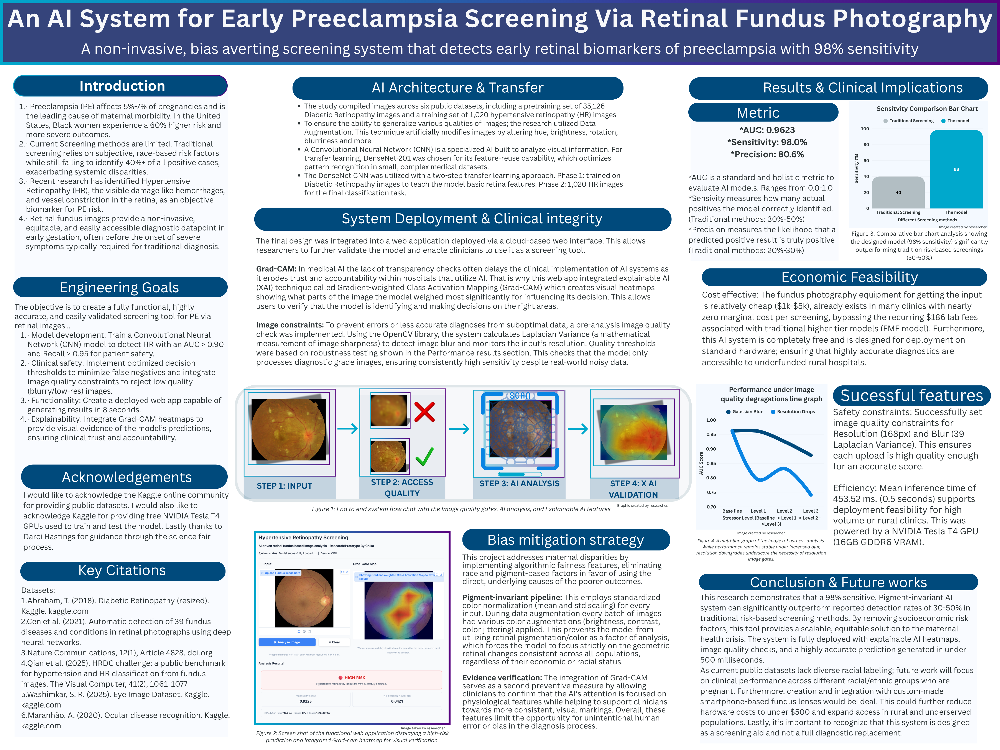

#     Preeclampsia-Research-Project
## Demo
https://huggingface.co/spaces/doeygirl93/preeclampsia_screener

## Overveiw
Preeclampsia is a serious pregnacy disorder and disportionetly impacts women of color. If not detected early. Preeclampsia can lead to severe outcomes for both the mother and baby.  This project explores an AI-driven system can help identify high‑risk cases for early PE screening by utilizing retinal fundus images 
This project was orginally trained in kaggle hence why i uploaded it. I used pytorch to train the model and gradio for the demo

## Awards won
I've quallified to the International Hosa research conference for my research and got 3rd place in washington

## Abstract
Preeclampsia (PE) is a leading cause of maternal morbidity, with Black women in the United States facing a 60% higher risk and more severe outcomes. Traditional screening methods often fail to identify over 40% of positive cases and rely on subjective, race-based risk factors. This research proposed a failure-aware, pigment-invariant AI system for early PE screening by utilizing retinal fundus images to detect hypertensive retinopathy biomarkers. A DenseNet-201 CNN was utilized with a two-phase transfer learning approach on over 36,000 images. To address racial disparities, a pigment-invariant pipeline was engineered using standardized color normalization and rigorous data augmentations to ignore retinal pigmentation. For clinical safety, real time quality gates using OpenCV Laplacian Variance and resolution monitoring were implemented to reject low quality diagnostic images. On an independent test set, the model achieved 98.0% sensitivity and a 0.96 AUC. The system was deployed as a web application delivering results in under 500ms, featuring Grad-CAM heatmaps for visual evidence and clinical accountability. These results demonstrate a scalable, low-cost, and equitable solution to the maternal health crisis that significantly outperforms traditional screening detection rates.

## Why I chose this
Persoanlly I'm a huge activist for both Women's and Black peoples health. Its underesearch, current tools don't work for us and I personally feel like as a black women myself that if even I don't take a change it won't happen. Thats why whenever I start big projects especial for research or protests etc. I will always tryna and make sure Black people & women are included. I honestly can't lie when i say that i litteraly just search up "whats the biggest problem in womens health" and "whats the Biggest health problems in the black community right now". Preeclampsia was one of the BIGGEST things that came up. Its insane how its such a big issue yet under researched. When I saw the disparity I knew i had to do something about this.
## Methods
Dataset: (Private)
tools: Python, pandas, pytorch, Scikit‑Learn, Matplotlib, Gradio
IDE: Kaggle

## Results
*AUC: 0.9623
*Sensitivity: 98.0%
*Precision: 80.6%

## .pth source file
https://drive.google.com/file/d/1gZbOciZcPVWQRucdkBLzHkTcA7luKAg6/view?usp=drive_link
